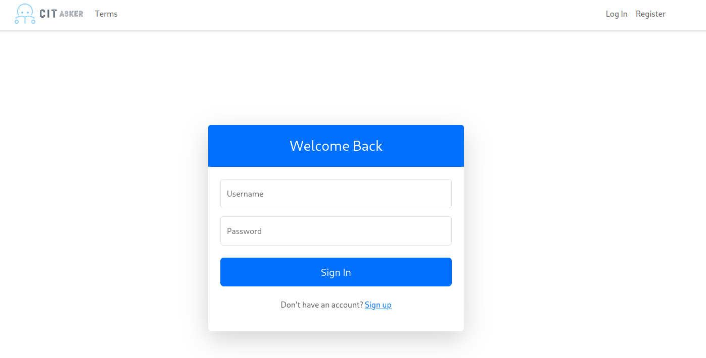
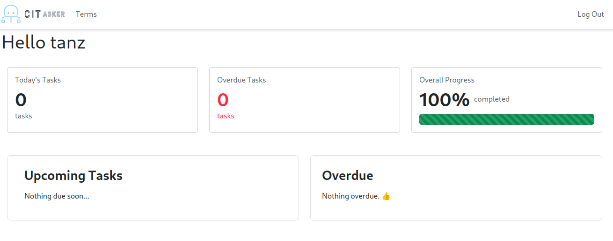
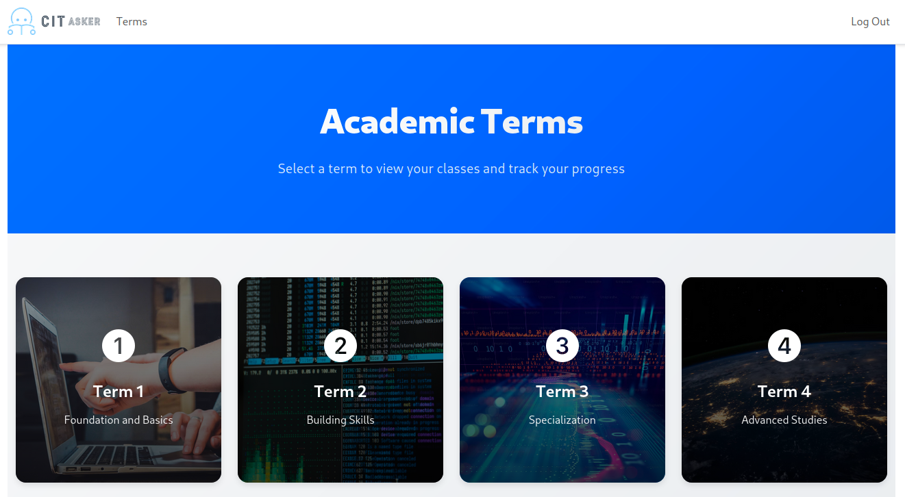
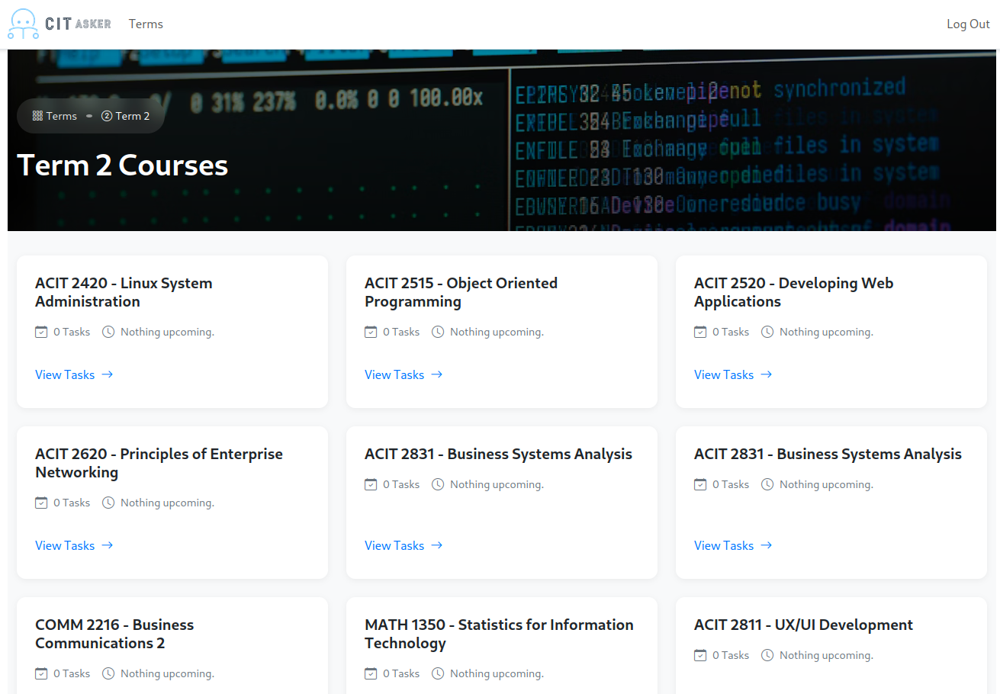
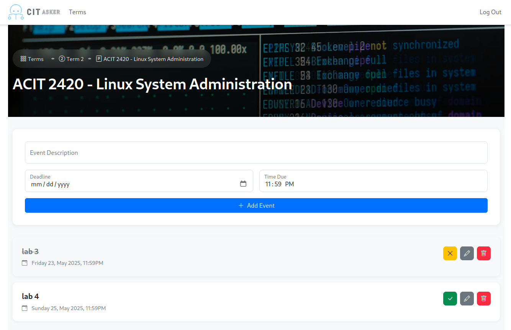
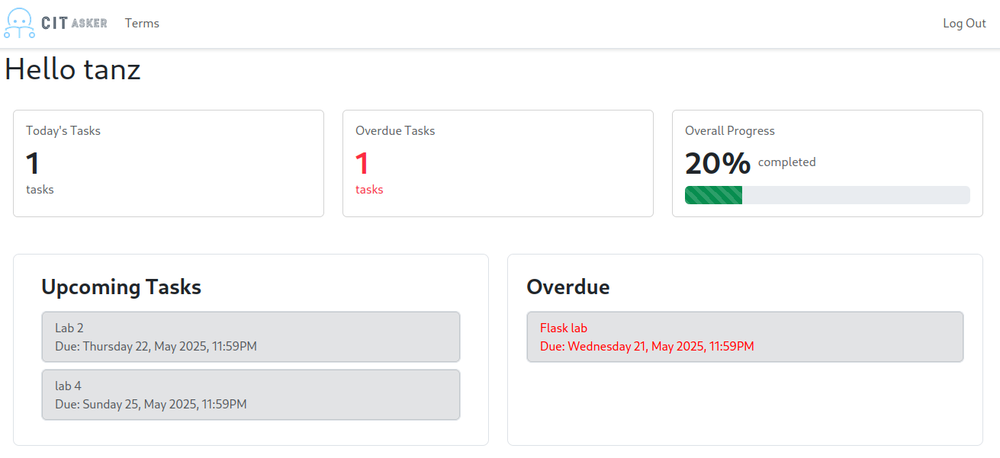

# CITracker
CITracker is a specialized to-do app built just for CIT students. It helps students stay organized by automatically sorting tasks by course and type, highlighting deadlines based on urgency, and providing a clear, structured overview of academic responsibilities.

# Site
The site is hosted on render, and can be accessed [here](https://citasker.tanzsrv.cc)

# Usage
The application can be accessed through the online option, or can be deployed on your personal machine
We also support mobile view! Manage all your tasks from your phone for easy access

## General Usage
When navigating to the main page, you will be greated with a login page
Making an account is simple, with only a username and password needed
We don't collect any other personal information, so we can't sell it ;)

Once a user is logged in, they will be greated with a dashboard which contains information about upcoming deadlines, deadlines due today, overall progress, and overdue tasks

Navigating to the tasks page from the navbar will take you to select your term, which contains all the classes for each term pre-loaded into the site
 

Each class card contains information about the amount of tasks you have, and when the next deadline is due

When viewing tasks for each class, you have options to add a new task and choose its due date and due time, and also toggle completion, edit or delete existing tasks

Dashboard automatically updates to reflect task and progression
